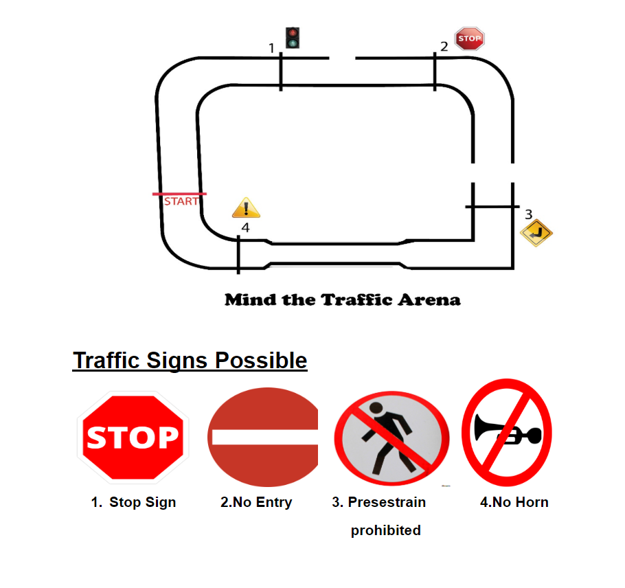

# Self-Driving-Car

A monocular-vision autonomous RC car prototype that drives itself around a marked arena using a Raspberry Pi camera, a small Keras CNN, and an Arduino-driven motor controller.

> Built in 2020 as a college project. Most-starred of my college repos.



## What it does

A Raspberry Pi 3 with a USB/CSI camera streams frames at runtime. Each frame is colour-masked (to suppress everything that isn't the dark track / signs), resized to 32x32x3, and classified by a small Keras CNN into one of five driving commands: forward, left, right, steep-left, steep-right. The predicted class is mapped to a single ASCII byte (`w`, `a`, `d`, `z`, `c`) and written over USB serial (`/dev/ttyACM0` at 9600 baud) to an Arduino UNO running an L293D motor driver, which controls two DC motors in a differential-drive layout. IR sensors mounted at the front detect black "deadline" lines on the arena and stop the bot independent of the CNN.

### The arena

The track is hand-built with a fixed visual vocabulary — track edges, steep-turn markers, a stop sign — so the CNN only needs to recognise a small number of classes.



### The bot

Raspberry Pi 3 + Arduino UNO + L293D motor driver, mounted on a differential-drive chassis with a Pi camera up front and IR reflectance sensors near the front wheels.


The same hardware can also be driven (a) manually as an RC car using keystrokes over the same serial link, or (b) as a pure line-follower using just IR sensors and the Arduino (no Pi, no CNN).

## Hardware

- Raspberry Pi 3 (Pi Camera, powered by a 12V adapter to avoid brown-outs during motor draw)
- Arduino UNO + L293D dual H-bridge
- 2x DC gear motors, differential drive chassis
- 2x IR reflectance sensors (front)
- USB serial between Pi and Arduino at 9600 baud

## Data pipeline

Training data was collected by hand-driving the robot around the arena and saving labelled frames (`Self driving car/Images with signs_Data Collection.py`). The collection script:

1. Reads frames from the Pi camera via OpenCV.
2. Vertically flips the frame (camera is mounted upside-down).
3. Applies a per-channel RGB threshold (`R<40, G<50, B<50` -> blacked out) to drop background clutter and emphasise dark track/sign features.
4. While the operator drives with WASD-style keys, writes the masked frame to a class folder: `data3/{front,left,right,steepleft,steepright,stopsign,no_crossing,end}/`.
5. Sends the same key over serial so the bot moves while data is being labelled — labels match what the human driver actually did.

Roughly 2000 frames per class were collected for `left, right, straight, sharp left, sharp right, stop`. Sample frames are checked into [`SampleData/`](SampleData/).

## Model architecture

Defined in [`Self driving car/Softmax training.py`](Self%20driving%20car/Softmax%20training.py).

| Layer | Config | Output shape |
|---|---|---|
| Input | RGB frame after masking | 32 x 32 x 3 |
| Conv2D | 32 filters, 3x3, ReLU, valid padding | 30 x 30 x 32 |
| MaxPool2D | 2x2 | 15 x 15 x 32 |
| Conv2D | 32 filters, 3x3, ReLU, valid padding | 13 x 13 x 32 |
| MaxPool2D | 2x2 | 6 x 6 x 32 |
| Conv2D | 32 filters, 3x3, ReLU, valid padding | 4 x 4 x 32 |
| MaxPool2D | 2x2 | 2 x 2 x 32 |
| Flatten | | 128 |
| Dense | 128 units, ReLU | 128 |
| Dense (output) | 5 units, softmax | 5 |

Saved weights: [`model.h5`](Self%20driving%20car/model.h5) (~167 KB). Saved architecture: [`model.json`](Self%20driving%20car/model.json).

> Note: the training script (`Softmax training.py`) compiles the model with a 5-way `softmax` head and `categorical_crossentropy` loss. The serialised `model.json` checked into the repo records the final dense layer as `sigmoid` rather than `softmax` — likely from an earlier checkpoint. The inference pipeline takes `argmax` (`predict_classes`), so this still works in practice but is worth flagging.

## Training

- Optimizer: Adam
- Loss: categorical crossentropy
- Augmentation: `ImageDataGenerator(rescale=1/255, shear_range=0.2, zoom_range=0.2, horizontal_flip=True)` on the training set, rescale-only on the test set
- Batch size: 32
- Epochs: 25, `steps_per_epoch=500`, `validation_steps=100`
- Hardware: trained off-bot on a development laptop; the `.h5` weights were copied to the Pi for inference

Training data was loaded via `flow_from_directory('dataset1/training_set', target_size=(32,32))`. The `dataset1/` folder is not checked in — only a small `SampleData/` set demonstrating each class is.

## Inference loop

[`Self driving car/Final Trained Pipeline.py`](Self%20driving%20car/Final%20Trained%20Pipeline.py) and [`Testing The Bot.py`](Self%20driving%20car/Testing%20The%20Bot.py) implement the runtime loop:

```
while camera open:
  frame = cv2.flip(VideoCapture.read(), 0)
  masked = apply_rgb_threshold(frame, 40, 50, 50)
  x = cv2.resize(masked, (32,32)).reshape(1,32,32,3)
  cls = argmax(model.predict(x))
  arduino.write({0:'w',1:'a',2:'d',3:'z',4:'c'}[cls])
```

The Arduino-side code ([`Arduino code.ino`](Arduino%20code.ino)) reads single bytes and PWMs the L293D pins:

| Byte | Meaning | Left motor PWM | Right motor PWM |
|---|---|---|---|
| `w` | forward | 255 | 255 |
| `a` | soft left | 170 | 255 |
| `d` | soft right | 255 | 170 |
| `z` | steep left | 0 | 255 |
| `c` | steep right | 255 | 0 |
| `s` | stop | 0 | 0 |

The IR sensor path uses a separate sketch ([`LineFollower.ino`](LineFollower.ino)) with three analogue IR sensors and pure rule-based motor mixing — no Pi or CNN involved.

## Results

The bot completed loops of the marked arena under good lighting. No formal accuracy numbers were logged on the test split — given the very small input (32x32) and ~3 conv layers, the model is intentionally light enough to run on a Pi 3 at usable framerates. The honest characterisation: it works well in the lighting it was trained in, and overfits to the specific arena (not surprising given hand-collected labels and only 5 classes).

## How to run

Python 3.7-ish era. Install:

```
pip install opencv-python keras tensorflow numpy pyserial matplotlib
```

On the Raspberry Pi (with the Arduino flashed using `Arduino code.ino`):

```
# Inference
cd "Self driving car"
python "Final Trained Pipeline.py"

# (Re)collect training data
python "Images with signs_Data Collection.py"

# Test camera only (no motors)
python "Testing Raspi Camera.py"
```

To retrain off-bot (after copying labelled data into `dataset1/training_set/<class>/` and `dataset1/test_set/<class>/`):

```
python "Softmax training.py"
# produces model.json + model.h5
```

## What I'd do differently today

- End-to-end regression (steering angle as a continuous output) instead of 5-class discretisation, so the bot can actually take "in-between" turns — closer to the NVIDIA PilotNet 2016 paper.
- Train and infer in fp16/int8 with TFLite so inference time on a Pi is bounded.
- Replace the hand-tuned RGB threshold with a learned segmentation head, or just feed raw frames at 64x64 — modern small CNNs handle this fine.
- A real ROS-style runtime instead of `while True: serial.write(byte)` — the current loop has no rate limiting and no failure mode if the Arduino disconnects.

## References

- Bojarski et al., "End to End Learning for Self-Driving Cars" (NVIDIA, 2016) — the original PilotNet paper that inspired the use of a CNN over a single forward camera.
- Keras documentation for `Sequential`, `Conv2D`, `ImageDataGenerator`.
- OpenCV documentation for `cv2.VideoCapture`, `cv2.flip`, `cv2.resize`.

## License

No license file was included with the original project. Treat as "all rights reserved, ask before reuse" until I add a proper license.
